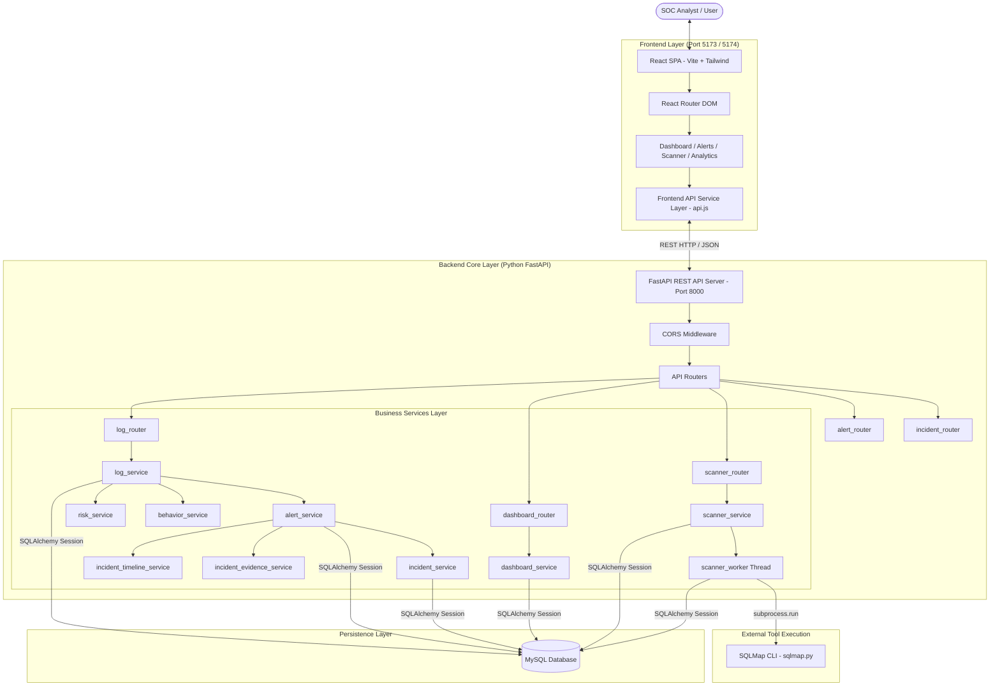
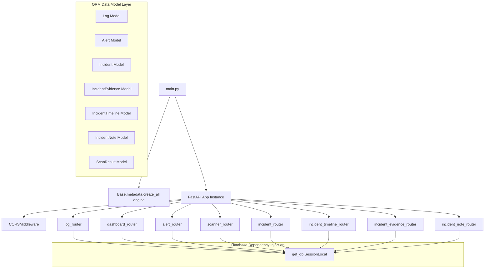
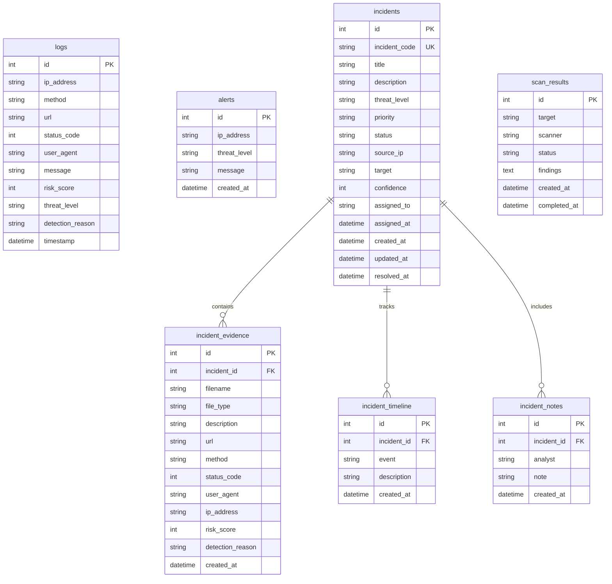
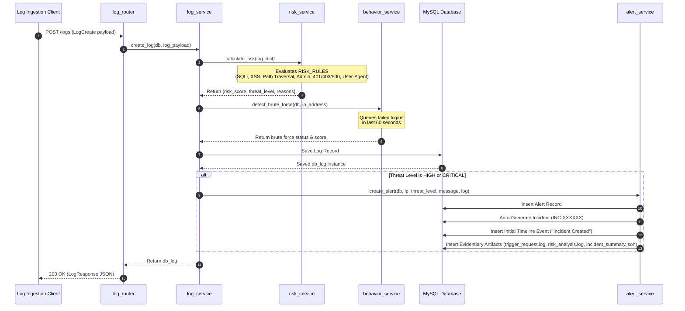
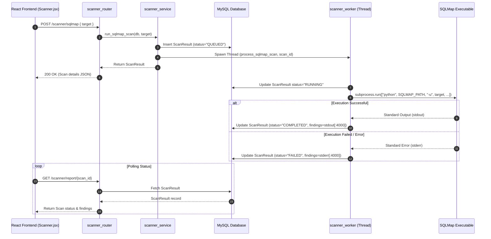
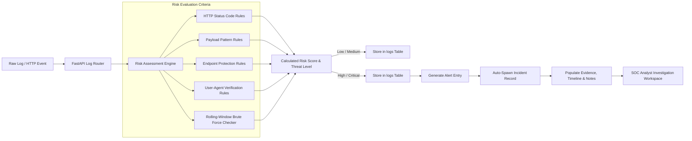
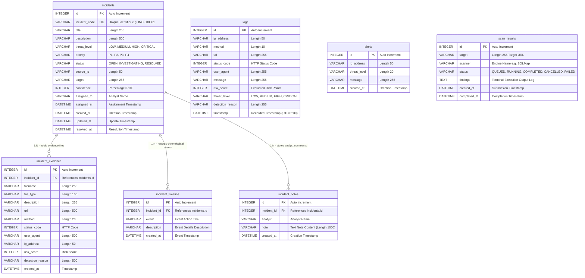
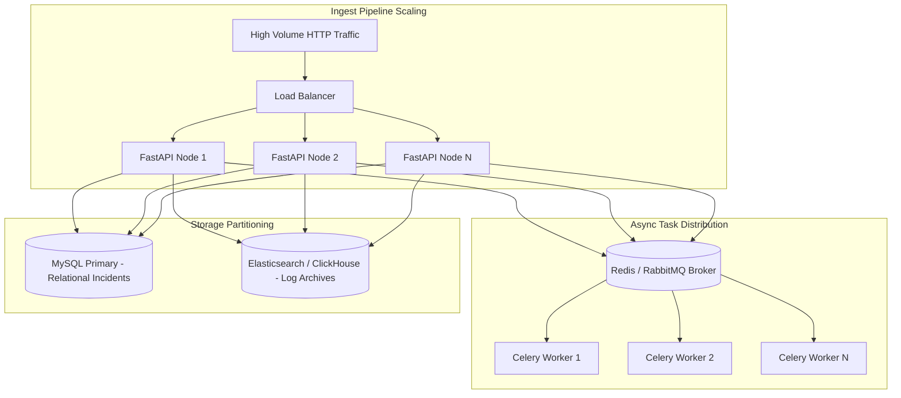

# Sentinel AI: Enterprise Security Operations & Threat Intelligence Platform
## Master Technical Specification & System Overview

> **Version:** 1.0.0  
> **Status:** Production-Ready Architecture  
> **Classification:** Technical Documentation & System Reference  
> **Repository:** `omkar-1849/Ghost-tracer` (Sentinel AI)

---

## Table of Contents

1. [Project Overview](#1-project-overview)
   - [1.1 Purpose](#11-purpose)
   - [1.2 Core Goals](#12-core-goals)
   - [1.3 Key Platform Features](#13-key-platform-features)
   - [1.4 Target User Personas](#14-target-user-personas)
2. [Technology Stack](#2-technology-stack)
   - [2.1 Frontend Architecture](#21-frontend-architecture)
   - [2.2 Backend Architecture](#22-backend-architecture)
   - [2.3 Database & ORM](#23-database--orm)
   - [2.4 APIs & Communication Protocols](#24-apis--communication-protocols)
   - [2.5 Libraries & Third-Party Integrations](#25-libraries--third-party-integrations)
   - [2.6 Build Tools & Runtime Environment](#26-build-tools--runtime-environment)
3. [Complete System Architecture](#3-complete-system-architecture)
   - [3.1 High-Level Architecture](#31-high-level-architecture)
   - [3.2 Frontend System Architecture](#32-frontend-system-architecture)
   - [3.3 Backend System Architecture](#33-backend-system-architecture)
   - [3.4 Database Architecture](#34-database-architecture)
   - [3.5 End-to-End API Flow](#35-end-to-end-api-flow)
   - [3.6 Telemetry & Risk Data Flow](#36-telemetry--risk-data-flow)
4. [Folder & Directory Structure](#4-folder--directory-structure)
   - [4.1 Repository Layout](#41-repository-layout)
   - [4.2 Directory Purpose & Breakdown](#42-directory-purpose--breakdown)
5. [Backend Engineering Details](#5-backend-engineering-details)
   - [5.1 Core Services Layer](#51-core-services-layer)
   - [5.2 API Routers](#52-api-routers)
   - [5.3 Data Models (SQLAlchemy ORM)](#53-data-models-sqlalchemy-orm)
   - [5.4 Schemas (Pydantic Data Contracts)](#54-schemas-pydantic-data-contracts)
   - [5.5 Configuration & Risk Rules Engine](#55-configuration--risk-rules-engine)
   - [5.6 Architectural Rationale & Design Decisions](#56-architectural-rationale--design-decisions)
6. [Frontend Engineering Details](#6-frontend-engineering-details)
   - [5.1 Views & Pages](#61-views--pages)
   - [6.2 Component Hierarchy & Widgets](#62-component-hierarchy--widgets)
   - [6.3 Shared UI & Common Components](#63-shared-ui--common-components)
   - [6.4 State Management & Data Polling](#64-state-management--data-polling)
   - [6.5 API Integration Layer](#65-api-integration-layer)
   - [6.6 Design System & Styling System](#66-design-system--styling-system)
7. [Database Architecture & Schema](#7-database-architecture--schema)
   - [7.1 Entity Relationship Diagram (ERD)](#71-entity-relationship-diagram-erd)
   - [7.2 Primary Data Tables](#72-primary-data-tables)
   - [7.3 Foreign Keys & Entity Relationships](#73-foreign-keys--entity-relationships)
8. [API Reference & Endpoint Specification](#8-api-reference--endpoint-specification)
   - [8.1 Dashboard Telemetry Endpoints](#81-dashboard-telemetry-endpoints)
   - [8.2 Ingestion & Log Endpoints](#82-ingestion--log-endpoints)
   - [8.3 Alerting Endpoints](#83-alerting-endpoints)
   - [8.4 Incident Management Endpoints](#84-incident-management-endpoints)
   - [8.5 Automated Vulnerability Scanner Endpoints](#85-automated-vulnerability-scanner-endpoints)
9. [Completed Features & Capabilities](#9-completed-features--capabilities)
   - [9.1 Feature Module Matrix](#91-feature-module-matrix)
10. [Remaining Technical Roadmap](#10-remaining-technical-roadmap)
    - [10.1 Short-Term & Long-Term Roadmap](#101-short-term--long-term-roadmap)
11. [UI/UX Enterprise SOC Design Philosophy](#11-uiux-enterprise-soc-design-philosophy)
    - [11.1 Design Principles & Visual Hierarchy](#111-design-principles--visual-hierarchy)
12. [Security Architecture & Considerations](#12-security-architecture--considerations)
    - [12.1 Security Controls & Safeguards](#121-security-controls--safeguards)
13. [Future Scalability & Evolution](#13-future-scalability--evolution)
    - [13.1 Scalability Blueprint](#131-scalability-blueprint)
14. [Conclusion](#14-conclusion)

---

## 1. Project Overview

### 1.1 Purpose

**Sentinel AI** is an enterprise-grade, real-time website security monitoring, threat detection, automated vulnerability assessment, and Security Operations Center (SOC) incident investigation platform. Designed to provide full-spectrum visibility into web application attack vectors, Sentinel AI continuously ingest HTTP traffic telemetry, evaluates incoming requests against an extensible risk-scoring engine, detects behavioral attack patterns (such as distributed brute-force attempts), auto-spawns structured security incidents, and enables SOC analysts to triage and remediate security events.

### 1.2 Core Goals

- **Real-Time Telemetry & Threat Ingestion:** Ingest raw web application HTTP logs and evaluate security risk with minimal latency.
- **Rule-Based & Behavioral Detection:** Combine deterministic pattern matching (SQLi, XSS, Path Traversal, Command Injection) with rolling-window behavioral frequency analysis (brute-force login detection).
- **Automated Incident Creation & Correlation:** Automatically escalate high-severity threats (`HIGH` and `CRITICAL`) into actionable security incidents populated with HTTP evidence snapshots, timeline events, and risk breakdown reports.
- **Automated Vulnerability Assessment:** Provide an integrated scanning suite leveraging asynchronous SQLMap execution for deep database vulnerability detection with live execution status tracking.
- **Unified SOC Analyst Experience:** Deliver an intuitive, high-density dashboard and incident investigation command center tailored for SOC teams.

### 1.3 Key Platform Features

1. **Automated Risk Engine:** Multi-factor heuristic risk calculator evaluating HTTP status codes, sensitive endpoint access (e.g., `/admin`), malicious request payloads, and unauthorized User-Agent strings.
2. **Behavioral Analysis Service:** Time-window query engine monitoring login failure bursts to flag automated brute-force attacks.
3. **SOC Command Dashboard:** Live telemetry visualization including threat distribution pie charts, 24-hour threat activity trends, top attacking IP rankings, top targeted URLs, posture security scoring, and live attack feeds.
4. **Incident Command & Investigation Workspace:** Full incident management workflow supporting severity filter queues, status transitions (`OPEN` -> `INVESTIGATING` -> `RESOLVED`), analyst assignment, investigation notes, evidentiary HTTP request capture, and timeline audit logs.
5. **Vulnerability Scanning Module:** Asynchronous SQLMap scanner controller supporting scan queuing, background thread execution, cancellation controls, and formatted terminal execution reports.

### 1.4 Target User Personas

- **SOC Analysts (L1/L2):** Monitor live attack feeds, triage auto-generated security incidents, analyze evidence payloads, add investigation notes, and manage incident life-cycles.
- **Security Engineers & Incident Responders:** Conduct deep-dive root-cause analysis using raw HTTP logs, execute targeted vulnerability scans, and track system security posture metrics over time.
- **DevSecOps Teams & System Administrators:** Audit web traffic anomalies, inspect targeted application endpoints, and verify security patch effectiveness.

---

## 2. Technology Stack

### 2.1 Frontend Architecture

| Category | Technology | Version | Purpose |
| :--- | :--- | :--- | :--- |
| **Core Framework** | React | `^19.2.7` | UI library for component-driven SPA interface |
| **Routing** | React Router DOM | `^7.18.2` | Client-side page navigation & route management |
| **Build Tool** | Vite | `^8.1.1` | Next-generation frontend build tool and dev server |
| **Styling** | Tailwind CSS | `^4.3.3` | Utility-first CSS framework for SOC layout styling |
| **Iconography** | Lucide React | `^1.27.0` | Comprehensive vector icon set for cyber UI elements |
| **Data Visualization** | Recharts | `^3.10.1` | SVG chart components for telemetry visualization |

### 2.2 Backend Architecture

| Category | Technology | Version | Purpose |
| :--- | :--- | :--- | :--- |
| **Web Framework** | FastAPI | `1.0.0` (App) | High-performance Python async web framework |
| **ASGI Server** | Uvicorn | Standard | Asynchronous server gateway interface |
| **Concurrency** | Python `threading` | Standard Lib | Asynchronous background worker threads for scanner execution |
| **Subprocess Exec** | Python `subprocess` | Standard Lib | Spawning external CLI processes (SQLMap execution) |

### 2.3 Database & ORM

| Category | Technology | Version / Syntax | Purpose |
| :--- | :--- | :--- | :--- |
| **Database Engine** | MySQL Server | `8.0+` | Relational database management system |
| **Database Driver** | PyMySQL | `mysql+pymysql` | Pure Python DB-API 2.0 compliant MySQL driver |
| **ORM Layer** | SQLAlchemy | `2.0+` | Python SQL Toolkit and Object Relational Mapper |
| **Data Validation** | Pydantic | `v2` | Data parsing, validation, and schema definitions |

### 2.4 APIs & Communication Protocols

- **RESTful Architecture:** HTTP/JSON endpoints adhering to standard REST semantics (`GET`, `POST`, `PATCH`).
- **CORS Middleware:** Configured cross-origin resource sharing allowing localhost dev origin communication (`http://localhost:5173`, `http://localhost:5174`, `http://127.0.0.1:5173`, `http://127.0.0.1:5174`).

### 2.5 Libraries & Third-Party Integrations

- **SQLMap:** Automated SQL injection and database takeover CLI tool executed via subprocess worker scripts.

### 2.6 Build Tools & Runtime Environment

- **Frontend Runtime:** Node.js v18+ / Vite environment.
- **Backend Runtime:** Python 3.11+ virtual environment (`venv`).

---

## 3. Complete System Architecture

### 3.1 High-Level Architecture



### 3.2 Frontend System Architecture

```mermaid
graph TD
    Entry[main.jsx] --> App[App.jsx Layout]
    App --> Sidebar[Sidebar.jsx Navigation]
    App --> RouteContainer[Routes Container]
    
    RouteContainer --> DashboardPage[Dashboard.jsx]
    RouteContainer --> AlertsPage[Alerts.jsx]
    RouteContainer --> ScannerPage[Scanner.jsx]
    RouteContainer --> AnalyticsPage[Analytics.jsx]
    RouteContainer --> SettingsPage[Settings.jsx]
    
    subgraph "Dashboard Components"
        DashboardPage --> SecurityScore[SecurityScore.jsx]
        DashboardPage --> StatCards[StatCard.jsx Widgets]
        DashboardPage --> LiveFeed[LiveAttackFeed.jsx]
        DashboardPage --> ThreatChartComp[ThreatChart.jsx]
        DashboardPage --> AttackTypesComp[AttackTypes.jsx]
        DashboardPage --> TopIPsComp[TopAttackingIPs.jsx]
        DashboardPage --> TopURLsComp[TopTargetedURLs.jsx]
        DashboardPage --> RecentAlertsComp[RecentAlerts.jsx]
        DashboardPage --> RecentLogsComp[RecentLogs.jsx]
    end
    
    subgraph "Alerts & Incident Investigation Components"
        AlertsPage --> AlertsHero[AlertsHero.jsx]
        AlertsPage --> SummaryStrip[SummaryStrip.jsx]
        AlertsPage --> IncidentQueue[IncidentQueue.jsx]
        IncidentQueue --> IncidentRow[IncidentRow.jsx]
        AlertsPage --> InvestWorkspace[InvestigationWorkspace.jsx]
        InvestWorkspace --> AttackDetails[AttackDetails.jsx]
        InvestWorkspace --> EvidencePanel[EvidencePanel.jsx]
        InvestWorkspace --> TimelineComp[IncidentTimeline.jsx]
        InvestWorkspace --> ResponseActions[ResponseActions.jsx]
    end
    
    subgraph "Analytics Components"
        AnalyticsPage --> AnalyticsHero[AnalyticsHero.jsx]
        AnalyticsPage --> AnalyticsSection[AnalyticsSection.jsx]
        AnalyticsPage --> ComingSoonPanel[ComingSoonPanel.jsx]
    end
    
    subgraph "API Gateway Client"
        DashboardPage & AlertsPage & ScannerPage --> APIServices[services/api.js]
    end
```



### 3.3 Backend System Architecture



### 3.4 Database Architecture



### 3.5 End-to-End API Flow

#### Flow 1: Telemetry Log Ingestion, Risk Assessment & Incident Creation



#### Flow 2: Automated SQLMap Vulnerability Scan Execution



### 3.6 Telemetry & Risk Data Flow



---

## 4. Folder & Directory Structure

### 4.1 Repository Layout

```
.
├── backend/
│   ├── app/
│   │   ├── config/
│   │   │   ├── __init__.py
│   │   │   └── rules.py
│   │   ├── database/
│   │   │   ├── __init__.py
│   │   │   ├── base.py
│   │   │   └── database.py
│   │   ├── models/
│   │   │   ├── __init__.py
│   │   │   ├── alert.py
│   │   │   ├── incident.py
│   │   │   ├── incident_evidence.py
│   │   │   ├── incident_note.py
│   │   │   ├── incident_timeline.py
│   │   │   ├── log.py
│   │   │   └── scan_result.py
│   │   ├── routers/
│   │   │   ├── __init__.py
│   │   │   ├── alert_router.py
│   │   │   ├── dashboard_router.py
│   │   │   ├── incident_evidence_router.py
│   │   │   ├── incident_note_router.py
│   │   │   ├── incident_router.py
│   │   │   ├── incident_timeline_router.py
│   │   │   ├── log_router.py
│   │   │   └── scanner_router.py
│   │   ├── schemas/
│   │   │   ├── __init__.py
│   │   │   ├── incident_evidence_schema.py
│   │   │   ├── incident_note_schema.py
│   │   │   ├── incident_schema.py
│   │   │   ├── incident_timeline_schema.py
│   │   │   ├── log_schema.py
│   │   │   └── scan_schema.py
│   │   ├── services/
│   │   │   ├── __init__.py
│   │   │   ├── alert_service.py
│   │   │   ├── behavior_service.py
│   │   │   ├── dashboard_service.py
│   │   │   ├── incident_evidence_service.py
│   │   │   ├── incident_note_service.py
│   │   │   ├── incident_service.py
│   │   │   ├── incident_timeline_service.py
│   │   │   ├── log_service.py
│   │   │   ├── risk_service.py
│   │   │   ├── scanner_service.py
│   │   │   └── scanner_worker.py
│   │   ├── utils/
│   │   │   └── __init__.py
│   │   ├── __init__.py
│   │   └── main.py
│   └── venv/
├── database/
├── docs/
│   └── old_dashboard.html
├── frontend/
│   ├── public/
│   ├── src/
│   │   ├── assets/
│   │   ├── components/
│   │   │   ├── alerts/
│   │   │   │   ├── AlertsBackground.jsx
│   │   │   │   ├── AlertsHero.jsx
│   │   │   │   ├── AlertsPage.css
│   │   │   │   ├── alertsData.js
│   │   │   │   ├── AttackDetails.jsx
│   │   │   │   ├── EvidencePanel.jsx
│   │   │   │   ├── IncidentQueue.jsx
│   │   │   │   ├── IncidentRow.jsx
│   │   │   │   ├── IncidentTimeline.jsx
│   │   │   │   ├── InvestigationWorkspace.jsx
│   │   │   │   ├── ResponseActions.jsx
│   │   │   │   └── SummaryStrip.jsx
│   │   │   ├── analytics/
│   │   │   │   ├── AnalyticsBackground.jsx
│   │   │   │   ├── AnalyticsCard.jsx
│   │   │   │   ├── AnalyticsHero.jsx
│   │   │   │   ├── AnalyticsPage.css
│   │   │   │   ├── AnalyticsSection.jsx
│   │   │   │   └── ComingSoonPanel.jsx
│   │   │   ├── AttackTypes.jsx
│   │   │   ├── Chart.jsx
│   │   │   ├── LiveAttackFeed.jsx
│   │   │   ├── Navbar.jsx
│   │   │   ├── RecentAlerts.jsx
│   │   │   ├── RecentLogs.jsx
│   │   │   ├── SecurityScore.jsx
│   │   │   ├── Sidebar.jsx
│   │   │   ├── StatCard.jsx
│   │   │   ├── ThreatChart.jsx
│   │   │   ├── ThreatDistribution.jsx
│   │   │   ├── TopAttackingIPs.jsx
│   │   │   └── TopTargetedURLs.jsx
│   │   ├── pages/
│   │   │   ├── Alerts.jsx
│   │   │   ├── Analytics.jsx
│   │   │   ├── Dashboard.jsx
│   │   │   ├── Scanner.jsx
│   │   │   └── Settings.jsx
│   │   ├── services/
│   │   │   └── api.js
│   │   ├── App.css
│   │   ├── App.jsx
│   │   ├── index.css
│   │   └── main.jsx
│   ├── eslint.config.js
│   ├── index.html
│   ├── package.json
│   ├── package-lock.json
│   └── vite.config.js
├── SENTINEL_AI_OVERVIEW.md
└── readme.md
```

### 4.2 Directory Purpose & Breakdown

- `backend/app/config/`: System-wide static rules and risk points definition (`rules.py`).
- `backend/app/database/`: Database connectivity setup, SQLAlchemy engine creation, session generators, and base metadata classes.
- `backend/app/models/`: SQLAlchemy ORM entity models mapping Python objects to MySQL database tables.
- `backend/app/routers/`: FastAPI route modules defining REST API endpoints grouped by operational domain.
- `backend/app/schemas/`: Pydantic models ensuring data validation, serialization, and input/output contracts.
- `backend/app/services/`: Core application logic, risk engines, analytics calculation, database query execution, and worker thread orchestration.
- `backend/app/utils/`: Reserved directory for shared utility functions and helpers.
- `frontend/src/pages/`: Primary page route components rendered by React Router.
- `frontend/src/components/`: Modular UI widgets. Subdivided into domain folders (`alerts/`, `analytics/`) and shared dashboard components.
- `frontend/src/services/`: Centralized HTTP API client abstractions (`api.js`).
- `database/`: Reserved for database migration scripts and schema definitions.
- `docs/`: Supplemental project files and historical reference assets.

---

## 5. Backend Engineering Details

### 5.1 Core Services Layer

The backend services layer encapsulates all business logic, decouples routing endpoints from database execution, and drives security workflows:

1. **`risk_service.py` (`calculate_risk`)**
   - Evaluates incoming log events against pre-configured risk rules (`RISK_RULES`).
   - Evaluates HTTP status codes (`401`: +15, `403`: +15, `500`: +10).
   - Detects sensitive paths (`/admin`: +25).
   - Inspects payloads for malicious strings:
     - **SQL Injection:** `'`, `or 1=1`, `union select`, `--`, `drop table`, `insert into` (+50 points).
     - **XSS:** `<script`, `alert(`, `onerror=`, `onload=` (+40 points).
     - **Path Traversal:** `../`, `..\`, `/etc/passwd`, `boot.ini` (+45 points).
     - **Command Injection:** `&&`, `||`, `;`, `$(`, `` ` `` (+60 points).
   - Detects suspicious User-Agents (`curl`, `python`, `wget`, `sqlmap`, `nikto`, `hydra`, `nmap`: +20 points).
   - Categorizes total risk score into threat levels:
     - `0 - 19`: **LOW**
     - `20 - 49`: **MEDIUM**
     - `50 - 79`: **HIGH**
     - `80+`: **CRITICAL**

2. **`behavior_service.py` (`detect_brute_force`)**
   - Executes rolling time-window queries checking for consecutive failed login attempts (`message LIKE '%login_failed%'`) within the last 60 seconds for a given IP address.
   - Triggers a **Brute Force Attack** flag (+50 risk points) when failed attempt count equals or exceeds 5.

3. **`log_service.py` (`create_log`, `get_recent_logs`)**
   - Orchestrates log creation: invokes `calculate_risk`, checks `detect_brute_force`, aggregates detection reasons, saves to the database, and automatically triggers alert/incident creation if threat level is `HIGH` or `CRITICAL`.

4. **`alert_service.py` (`create_alert`, `get_recent_alerts`)**
   - Spawns Alert records for critical events.
   - Automatically initializes a corresponding Incident record (`INC-XXXXXX`) with default priority `P2`, status `OPEN`, and confidence `90%`.
   - Automatically attaches initial timeline events and evidence snapshots (`trigger_request.log`, `risk_analysis.log`, `incident_summary.json`).

5. **`dashboard_service.py`**
   - Aggregates telemetry stats: log counts, alert counts, critical/high breakdown.
   - Computes top 10 attacking IPs and top 10 targeted URLs via SQL `GROUP BY` aggregations.
   - Calculates 24-hour threat activity trends and threat level distributions.
   - Computes system **Security Posture Score**: starts at 100 and applies weighted penalties based on log threat levels (`CRITICAL`: -5, `HIGH`: -3, `MEDIUM`: -1).

6. **`incident_service.py` & Related Services**
   - Provides CRUD management for incidents, support for status updates (`OPEN`, `INVESTIGATING`, `RESOLVED`), analyst assignment, timeline generation, evidence listing, analyst notes addition, and high-level incident statistics aggregation.

7. **`scanner_service.py` & `scanner_worker.py`**
   - Manages SQLMap scan records.
   - Spawns asynchronous daemon threads (`process_sqlmap_scan`) executing SQLMap via Python's `subprocess.run`.
   - Handles scan execution timeouts (1800s), status transitions (`QUEUED` -> `RUNNING` -> `COMPLETED` / `FAILED`), cancellation checks (`CANCELLED`), and stdout/stderr capture (capped at 4000 characters).

### 5.2 API Routers

- **`log_router.py`** (`/logs`): Ingests logs and fetches recent activity.
- **`dashboard_router.py`** (`/dashboard`): Exposes stats, security score, top IPs, targeted URLs, threat activity, threat distribution, and live attack feeds.
- **`alert_router.py`** (`/alerts`): Exposes recent security alert feeds.
- **`scanner_router.py`** (`/scanner`): Initiates scans (`/sqlmap`), cancels active scans, lists scan history, and retrieves scan reports.
- **`incident_router.py`** (`/incidents`): List incidents with multi-field filtering, fetch incident details with timeline/evidence/notes, update status, and assign analysts.
- **`incident_timeline_router.py`**, **`incident_evidence_router.py`**, **`incident_note_router.py`**: Sub-routers managing specific incident details.

### 5.3 Data Models (SQLAlchemy ORM)

All ORM models inherit from `DeclarativeBase` defined in `app/database/base.py`:

- **`Log`** (`logs`): Telemetry table storing request IP, HTTP method, URL, status code, user agent, message, calculated risk score, threat level, detection reason, and timestamp.
- **`Alert`** (`alerts`): Security alert table storing source IP, threat level, alert message, and creation timestamp.
- **`Incident`** (`incidents`): Core incident management table storing unique code (`INC-XXXXXX`), title, description, threat level, priority, status, source IP, target endpoint, confidence, assignee info, and lifecycle timestamps.
- **`IncidentEvidence`** (`incident_evidence`): Evidence entity linked via `incident_id` storing evidence filename, file type, description, HTTP request attributes, risk score, and detection reasons.
- **`IncidentTimeline`** (`incident_timeline`): Audit log entity linked via `incident_id` recording events (Creation, Assignment, Notes, Status changes).
- **`IncidentNote`** (`incident_notes`): Work notes added by analysts.
- **`ScanResult`** (`scan_results`): SQLMap scan tracking entity storing target URL, scanner engine name, execution status, findings text output, and timestamps.

### 5.4 Schemas (Pydantic Data Contracts)

- **`log_schema.py`**: `LogCreate` (ingress payload validation) and `LogResponse` (egress serialization with ORM attribute compatibility `from_attributes = True`).
- **`scan_schema.py`**: `ScanRequest` and `ScanResponse`.
- **`incident_schema.py`**: `IncidentCreate`, `IncidentUpdateStatus`, `IncidentAssign`, and `IncidentResponse`.
- **`incident_evidence_schema.py`**, **`incident_note_schema.py`**, **`incident_timeline_schema.py`**: Sub-schemas enforcing strict API interfaces for incident sub-resources.

### 5.5 Configuration & Risk Rules Engine

The central configuration in `app/config/rules.py` establishes the quantitative risk matrix:

```python
RISK_RULES = {
    "FAILED_LOGIN": 20,
    "HTTP_401": 15,
    "HTTP_403": 15,
    "HTTP_500": 10,
    "ADMIN_ACCESS": 25,
    "SQL_INJECTION": 50,
    "XSS": 40,
    "PATH_TRAVERSAL": 45,
    "COMMAND_INJECTION": 60,
    "SUSPICIOUS_USER_AGENT": 20,
    "BRUTE_FORCE": 50
}
```

### 5.6 Architectural Rationale & Design Decisions

- **FastAPI Framework Choice:** Chosen for low overhead, async capabilities, automated OpenAPI documentation generation, and native integration with Pydantic.
- **Service-Oriented Decoupling:** Decoupled business logic from API routers to simplify unit testing, service reuse across endpoints, and future modularization.
- **Asynchronous Thread Worker for Scanners:** Offloaded CLI execution (SQLMap) to background daemon threads to prevent blocking the main asyncio event loop during long-running scans.
- **Explicit UTC+5:30 Datetime Handling:** Applied consistent offset adjustments (`datetime.utcnow() + timedelta(hours=5, minutes=30)`) across models to ensure time synchronization for local deployment contexts.

---

## 6. Frontend Engineering Details

### 6.1 Views & Pages

1. **`Dashboard.jsx` (`/`):** The primary SOC operations command center. Aggregates security posture metrics, total log telemetry, active alert counters, threat level distribution, attack type breakdowns, top attacking IP tables, top targeted URLs, live attack feeds, and recent alert queues.
2. **`Alerts.jsx` (`/alerts`):** Incident Command & Investigation Workspace. Features search and filter queues (by status, severity, assignment), incident summary counters, an interactive incident queue, and an investigation panel providing tabs for Attack Details, Evidence Files, Incident Timeline, and Response Actions / Analyst Notes.
3. **`Scanner.jsx` (`/scanner`):** Automated Vulnerability Scanning portal. Allows security engineers to submit target URLs for SQLMap scans, monitor real-time scan statuses (`QUEUED`, `RUNNING`, `COMPLETED`, `CANCELLED`, `FAILED`), cancel active scans, and view full stdout terminal execution logs.
4. **`Analytics.jsx` (`/analytics`):** Advanced Threat Intelligence view. Displays analytics summaries, threat category distribution cards, and a preview panel highlighting upcoming predictive threat modeling capabilities.
5. **`Settings.jsx` (`/settings`):** Platform configuration interface for setting system parameters and API configurations.

### 6.2 Component Hierarchy & Widgets

```
App (Layout & Sidebar Navigation)
├── Dashboard Page
│   ├── SecurityScore Component (Posture Gauge & Status Indicator)
│   ├── StatCard Components (Total Logs, Total Alerts, Critical, High)
│   ├── LiveAttackFeed Component (Real-Time High/Critical Threat Feed)
│   ├── ThreatChart Component (24-Hour Threat Activity Line/Area Chart)
│   ├── ThreatDistribution Component (Threat Level Pie/Donut Chart)
│   ├── AttackTypes Component (Attack Classification Bar Chart)
│   ├── TopAttackingIPs Component (Ranked Attacker IP Data Table)
│   ├── TopTargetedURLs Component (Targeted URL Endpoint Data Table)
│   ├── RecentAlerts Component (Alert History Table)
│   └── RecentLogs Component (Raw Log Telemetry Feed Table)
│
├── Alerts Page (Incident Command Center)
│   ├── AlertsHero (Header Metrics & SOC Status Banner)
│   ├── SummaryStrip (Quick-filter Metric Cards)
│   ├── IncidentQueue (Searchable & Filterable Incident List)
│   │   └── IncidentRow (Individual Incident Summary Card)
│   └── InvestigationWorkspace (Detailed Incident Workspace)
│       ├── AttackDetails (Target, Source IP, Confidence, Category)
│       ├── EvidencePanel (Evidentiary Artifact Viewer & Downloads)
│       ├── IncidentTimeline (Chronological Audit Event Log)
│       └── ResponseActions (Analyst Notes & Incident Resolution Controls)
│
├── Scanner Page
│   ├── Target Input Form & Scan Launch Controller
│   ├── Active Scan Status Gauge & Cancel Controls
│   ├── Scan History Table
│   └── Terminal Console (SQLMap Execution Output Log)
│
└── Analytics Page
    ├── AnalyticsHero & Background Cyber Grids
    ├── AnalyticsSection & AnalyticsCards
    └── ComingSoonPanel (AI Threat Modeling Preview)
```

### 6.3 Shared UI & Common Components

- **`Sidebar.jsx`:** Fixed left-hand navigation sidebar displaying platform branding, operational status indicators ("SYSTEM ONLINE"), nav links with active-route highlights, and quick access controls.
- **`Navbar.jsx`:** Top navigation bar displaying breadcrumbs, search inputs, system notifications, and user profile information.
- **`StatCard.jsx`:** Reusable widget displaying key performance metrics, icon badges, value trends, and dynamic border accents.

### 6.4 State Management & Data Polling

- **Local State (`useState`):** Manages local view states, active tabs, modal visibility, filter parameters, and analyst form inputs.
- **Data Lifecycle (`useEffect`):** Orchestrates API data fetching on component mount.
- **Polling Intervals:** Implemented periodic data fetching (e.g., polling every 3–5 seconds) on the Dashboard live feed and Scanner execution status to provide real-time updates without page reloads.

### 6.5 API Integration Layer

The centralized API gateway in `frontend/src/services/api.js` encapsulates all HTTP requests to the backend server (`http://127.0.0.1:8000`):

- **Dashboard Services:** `getDashboardStats`, `getRecentLogs`, `getRecentAlerts`, `getTopAttackingIPs`, `getThreatActivity`, `getThreatDistribution`, `getTopTargetedURLs`, `getSecurityScore`, `getAttackTypes`, `getLiveFeed`.
- **Scanner Services:** `startSQLMapScan`, `getScanHistory`, `getScanReport`, `cancelScan`, `getScanById`.
- **Incident Services:** `getIncidents`, `getIncidentById`, `updateIncidentStatus`, `assignIncident`, `getIncidentStatistics`, `addIncidentNote`.

### 6.6 Design System & Styling System

- **Color Palette:** Custom cybersecurity dark mode using Tailwind CSS slate values:
  - Background Canvas: `bg-slate-950` / `bg-slate-900`
  - Card & Container Surfaces: `bg-slate-900/80` with backdrop blur (`backdrop-blur-md`)
  - Borders: `border-slate-800` / `border-slate-700/50`
- **Threat Level Accent System:**
  - `CRITICAL`: Neon Rose / Red (`text-rose-400`, `bg-rose-500/10`, `border-rose-500/30`)
  - `HIGH`: Amber / Orange (`text-amber-400`, `bg-amber-500/10`, `border-amber-500/30`)
  - `MEDIUM`: Yellow / Gold (`text-yellow-400`, `bg-yellow-500/10`, `border-yellow-500/30`)
  - `LOW`: Emerald / Green (`text-emerald-400`, `bg-emerald-500/10`, `border-emerald-500/30`)
- **Cyber Grid Aesthetic:** Subtle CSS background grids, glowing dot indicators (`animate-pulse`), monospace typography for IP addresses and HTTP payloads, and glassmorphic card overlays.

---

## 7. Database Architecture & Schema

### 7.1 Entity Relationship Diagram (ERD)



### 7.2 Primary Data Tables

1. **`logs`**: Telemetry log table storing every HTTP request processed by the platform along with computed risk metrics. Indexed on primary key `id`.
2. **`alerts`**: High-priority alert table created when high or critical threats are detected. Indexed on primary key `id`.
3. **`incidents`**: Central incident management table. Features a unique indexed code `incident_code` (e.g., `INC-000042`) and tracks incident life-cycles.
4. **`incident_evidence`**: Evidence table linked to `incidents` via foreign key `incident_id`. Stores HTTP payloads, log metadata, and system risk summaries.
5. **`incident_timeline`**: Audit log table linked to `incidents` via foreign key `incident_id`. Tracks historical incident state changes.
6. **`incident_notes`**: Work notes table linked to `incidents` via foreign key `incident_id`. Stores comments added by analysts during investigations.
7. **`scan_results`**: Scanner execution tracking table storing targets, statuses, stdout/stderr findings, and timestamps.

### 7.3 Foreign Keys & Entity Relationships

- `incident_evidence.incident_id` -> `incidents.id`
- `incident_timeline.incident_id` -> `incidents.id`
- `incident_notes.incident_id` -> `incidents.id`

---

## 8. API Reference & Endpoint Specification

### 8.1 Dashboard Telemetry Endpoints

#### 1. Fetch Dashboard High-Level Statistics
- **Endpoint:** `GET /dashboard/stats`
- **Description:** Returns aggregate telemetry metrics including total logs, total alerts, critical alert counts, and high alert counts.
- **Response Example:**
  ```json
  {
    "total_logs": 12450,
    "total_alerts": 84,
    "critical_alerts": 12,
    "high_alerts": 32
  }
  ```

#### 2. Fetch Top Attacking IPs
- **Endpoint:** `GET /dashboard/top-attacking-ips`
- **Description:** Returns the top 10 IP addresses generating the highest volume of log activity.
- **Response Example:**
  ```json
  [
    { "ip_address": "192.168.1.105", "attack_count": 342 },
    { "ip_address": "10.0.4.12", "attack_count": 218 }
  ]
  ```

#### 3. Fetch Threat Activity Trend
- **Endpoint:** `GET /dashboard/threat-activity`
- **Description:** Returns threat event counts aggregated by hour of the day.

#### 4. Fetch Threat Level Distribution
- **Endpoint:** `GET /dashboard/threat-distribution`
- **Description:** Returns log counts grouped by threat level (`LOW`, `MEDIUM`, `HIGH`, `CRITICAL`).

#### 5. Fetch Top Targeted URLs
- **Endpoint:** `GET /dashboard/top-targeted-urls`
- **Description:** Returns the top 10 URL endpoints targeted by incoming traffic.

#### 6. Fetch Security Posture Score
- **Endpoint:** `GET /dashboard/security-score`
- **Description:** Calculates and returns the platform's overall security score (0 to 100).

#### 7. Fetch Attack Type Classification Breakdown
- **Endpoint:** `GET /dashboard/attack-types`
- **Description:** Aggregates and returns counts for attack types (SQL Injection, Brute Force, XSS, Path Traversal, Admin Access).

#### 8. Fetch Live Attack Feed
- **Endpoint:** `GET /dashboard/live-feed`
- **Description:** Returns the top 10 most recent `HIGH` and `CRITICAL` log events for real-time dashboard display.

---

### 8.2 Ingestion & Log Endpoints

#### 1. Ingest HTTP Log Event
- **Endpoint:** `POST /logs`
- **Request Body (`LogCreate`):**
  ```json
  {
    "ip_address": "45.33.32.156",
    "method": "POST",
    "url": "/login.php",
    "status_code": 401,
    "user_agent": "Mozilla/5.0 (Windows NT 10.0; Win64; x64)",
    "message": "login_failed for user admin"
  }
  ```
- **Response (`LogResponse`):** Returns the saved log entry populated with calculated `risk_score`, `threat_level`, and `detection_reason`.

#### 2. Fetch Recent Logs
- **Endpoint:** `GET /logs/recent`
- **Description:** Retrieves the 10 most recent log entries.

---

### 8.3 Alerting Endpoints

#### 1. Fetch Recent Alerts
- **Endpoint:** `GET /alerts/recent`
- **Description:** Retrieves the 5 most recent security alert records.

---

### 8.4 Incident Management Endpoints

#### 1. List Incidents (Filterable Queue)
- **Endpoint:** `GET /incidents/`
- **Query Parameters:** `status`, `severity`, `assigned_to`, `search`, `limit` (default: 20), `offset` (default: 0).
- **Response:** List of matching incident records.

#### 2. Fetch Incident Details
- **Endpoint:** `GET /incidents/{incident_id}`
- **Description:** Retrieves an incident record along with its associated `timeline`, `evidence`, and `notes`.

#### 3. Update Incident Status
- **Endpoint:** `PATCH /incidents/{incident_id}/status`
- **Request Body (`IncidentUpdateStatus`):** `{ "status": "RESOLVED" }`
- **Description:** Updates the incident status and appends a timeline event upon resolution.

#### 4. Assign Analyst to Incident
- **Endpoint:** `PATCH /incidents/{incident_id}/assign`
- **Request Body (`IncidentAssign`):** `{ "assigned_to": "Analyst Sarah" }`
- **Description:** Assigns an analyst to the incident and records an assignment timeline event.

#### 5. Add Analyst Investigation Note
- **Endpoint:** `POST /incidents/{incident_id}/notes`
- **Request Body (`IncidentNoteCreate`):** `{ "analyst": "Analyst Sarah", "note": "Verified payload in sandbox." }`
- **Description:** Appends an analyst note to the incident and updates the timeline.

#### 6. Fetch Incident Overview Statistics
- **Endpoint:** `GET /incidents/statistics/overview`
- **Description:** Returns incident counts categorized by status (`open`, `investigating`, `resolved`) and threat level (`critical`, `high`, `medium`, `low`).

---

### 8.5 Automated Vulnerability Scanner Endpoints

#### 1. Trigger SQLMap Scan
- **Endpoint:** `POST /scanner/sqlmap`
- **Request Body (`ScanRequest`):** `{ "target": "http://testphp.vulnweb.com/listproducts.php?cat=1" }`
- **Description:** Queues a SQLMap scan and spawns a background execution thread.

#### 2. Cancel Running / Queued Scan
- **Endpoint:** `POST /scanner/{scan_id}/cancel`
- **Description:** Marks a queued or active scan status as `CANCELLED`.

#### 3. Fetch Scan History
- **Endpoint:** `GET /scanner/history`
- **Description:** Retrieves all scan history records ordered by creation timestamp.

#### 4. Fetch Scan Execution Report
- **Endpoint:** `GET /scanner/report/{scan_id}`
- **Description:** Retrieves details and stdout/stderr findings for a specific scan ID.

---

## 9. Completed Features & Capabilities

### 9.1 Feature Module Matrix

| Feature Module | Implementation Status | Core Capabilities & Technical Highlights |
| :--- | :--- | :--- |
| **Real-Time Log Ingestion** | **Completed** | REST endpoint ingesting HTTP telemetry, calculating dynamic risk scores, and evaluating threat levels. |
| **Heuristic Risk Engine** | **Completed** | Multi-factor rule evaluator detecting SQLi, XSS, Path Traversal, Command Injection, suspicious User-Agents, path patterns, and status codes. |
| **Behavioral Attack Detector** | **Completed** | Rolling 60-second window query engine detecting brute-force login attempts based on IP address failure thresholds. |
| **Automated Alerting** | **Completed** | Automatic escalation of `HIGH` and `CRITICAL` logs to security alert records. |
| **Incident Response Engine** | **Completed** | Automated generation of structured security incidents (`INC-XXXXXX`) with auto-attached evidence files, timeline logs, and summary metadata. |
| **SOC Dashboard Interface** | **Completed** | Full React dashboard featuring security posture gauges, Recharts threat trends, top attacking IP rankings, targeted URL breakdowns, and live attack feeds. |
| **Incident Command Workspace** | **Completed** | Searchable incident queue supporting status transitions (`OPEN`/`INVESTIGATING`/`RESOLVED`), analyst assignment, evidence viewer, timeline tracking, and note-taking. |
| **Automated SQLMap Scanner** | **Completed** | Background worker thread orchestrating SQLMap CLI execution, supporting scan queuing, thread execution, cancellation controls, and stdout output reports. |
| **Analytics Suite** | **Completed** | Intelligence dashboard providing threat classification metrics and preview panels for future AI threat modeling capabilities. |

---

## 10. Remaining Technical Roadmap

### 10.1 Short-Term & Long-Term Roadmap

```mermaid
timeline
    title Sentinel AI Engineering Roadmap
    section Phase 1: Authentication & SOAR
        Multi-Tenant Auth : Implement JWT & OAuth2 RBAC authentication
        Firewall Integration : Automated IP blocking via iptables / cloud firewall APIs
    section Phase 2: AI & Real-Time Engine
        ML Anomaly Engine : Isolation Forest & autoencoder models for zero-day threat detection
        WebSocket Streaming : Replace polling with SSE / WebSockets for live log streaming
    section Phase 3: Advanced Scanning & Enterprise
        Multi-Tool Scanners : Integrate Nmap, Nikto, and OWASP ZAP scanner workers
        Distributed Workers : Upgrade background threads to Celery / Redis task queues
```

#### Phase 1: Authentication, RBAC & Automated Response (SOAR)
- **Enterprise Authentication:** Implement JWT and OAuth2 multi-tenant authentication with Role-Based Access Control (RBAC) separating Analyst, Admin, and Read-Only roles.
- **Active Response Engine (SOAR):** Implement automated firewall blocking integrations (e.g., executing local `iptables` or cloud firewall API calls to automatically block IPs associated with `CRITICAL` brute-force or injection attacks).

#### Phase 2: AI Anomaly Detection & WebSockets
- **Machine Learning Threat Modeling:** Expand the `Analytics` engine by integrating scikit-learn anomaly detection models (e.g., Isolation Forests) to detect zero-day traffic deviations alongside deterministic rules.
- **WebSocket / Event Source Streaming:** Replace HTTP polling mechanisms with WebSockets or Server-Sent Events (SSE) for low-latency live log feed rendering and terminal output tailing.

#### Phase 3: Multi-Scanner Framework & Distributed Scaling
- **Expanded Scanner Suite:** Abstract `scanner_service` into a plugin architecture supporting Nmap port scans, Nikto web server assessments, and OWASP ZAP scanning.
- **Distributed Worker Queues:** Transition background thread execution (`threading.Thread`) to distributed task queues using Celery and Redis to enable horizontally scalable vulnerability scanning.

---

## 11. UI/UX Enterprise SOC Design Philosophy

### 11.1 Design Principles & Visual Hierarchy

Sentinel AI adheres to modern enterprise Security Operations Center (SOC) visual guidelines designed to minimize cognitive load during high-stress incident responses:

1. **High Information Density with Clear Visual Hierarchy:** Vital operational metrics (Security Score, Active Alerts, Critical Counters) are rendered at the top using custom stat widgets, followed by primary telemetry charts, and detailed data tables at the base.
2. **High-Contrast Dark Canvas:** Built on an ultra-dark background (`slate-950`) to reduce screen glare during extended SOC operations and make threat indicator colors clearly visible.
3. **Color-Coded Severity Palette:** Strict application of standardized security alert colors (`CRITICAL`: Rose/Red, `HIGH`: Amber/Orange, `MEDIUM`: Yellow, `LOW`: Emerald/Green) ensures analysts can immediately gauge system posture without reading raw text.
4. **Contextual Investigation Drawer:** The Incident Command workspace uses tabbed panels (Details, Evidence, Timeline, Actions) to keep critical incident context accessible on a single screen without requiring disruptive context switches.

---

## 12. Security Architecture & Considerations

### 12.1 Security Controls & Safeguards

- **CORS Restrictive Policy:** Backend CORS middleware explicitly limits allowed origins to authorized frontend developer ports (`http://localhost:5173`, `http://127.0.0.1:5173`), preventing unauthorized cross-origin requests.
- **Parameter Validation & Injection Prevention:** FastAPI router endpoints rely on Pydantic schemas for request body validation. All SQL database operations use parameterized SQLAlchemy ORM queries, eliminating SQL injection risks within the platform itself.
- **Subprocess Execution Safety:** The `scanner_worker` executes SQLMap via explicit argument vectors (`subprocess.run(["python", SQLMAP_PATH, "-u", target, ...])`), avoiding shell interpretation (`shell=False`) to prevent command injection risks.
- **Bounded Log Buffering:** Output streams captured from external tool executions are explicitly truncated (`[:4000]` characters) before database storage, preventing memory exhaustion or database buffer overflow issues.
- **Database Session Isolation:** Database sessions rely on FastAPI dependency injection (`Depends(get_db)`) with strict `try...finally db.close()` cleanup patterns, preventing session leakage and connection pool exhaustion.

---

## 13. Future Scalability & Evolution

### 13.1 Scalability Blueprint



- **Stateless API Layer:** The FastAPI backend is entirely stateless, allowing simple horizontal scaling behind a round-robin load balancer (e.g., NGINX, HAProxy, AWS ALB).
- **Asynchronous Task Queue Decoupling:** Long-running operations (SQLMap scans, heavy risk queries) can easily transition from local background threads to distributed Celery/Redis worker clusters.
- **Database Storage Tiering:** High-volume raw HTTP logs can be offloaded to time-series optimized storage engines (such as ClickHouse or Elasticsearch), keeping MySQL lightweight for core relational incident management and configuration data.

---

## 14. Conclusion

**Sentinel AI** delivers a modern, robust, and extensible open-source web application security monitoring and incident response platform. By unifying raw HTTP telemetry ingestion, heuristic payload risk scoring, rolling-window behavioral attack detection, automated incident generation, and asynchronous vulnerability scanning into a high-density SOC interface, Sentinel AI bridges the gap between raw web logging and actionable security intelligence. Its modular architecture provides a flexible foundation for scaling into enterprise SOAR environments, AI anomaly detection pipelines, and distributed threat response infrastructures.
